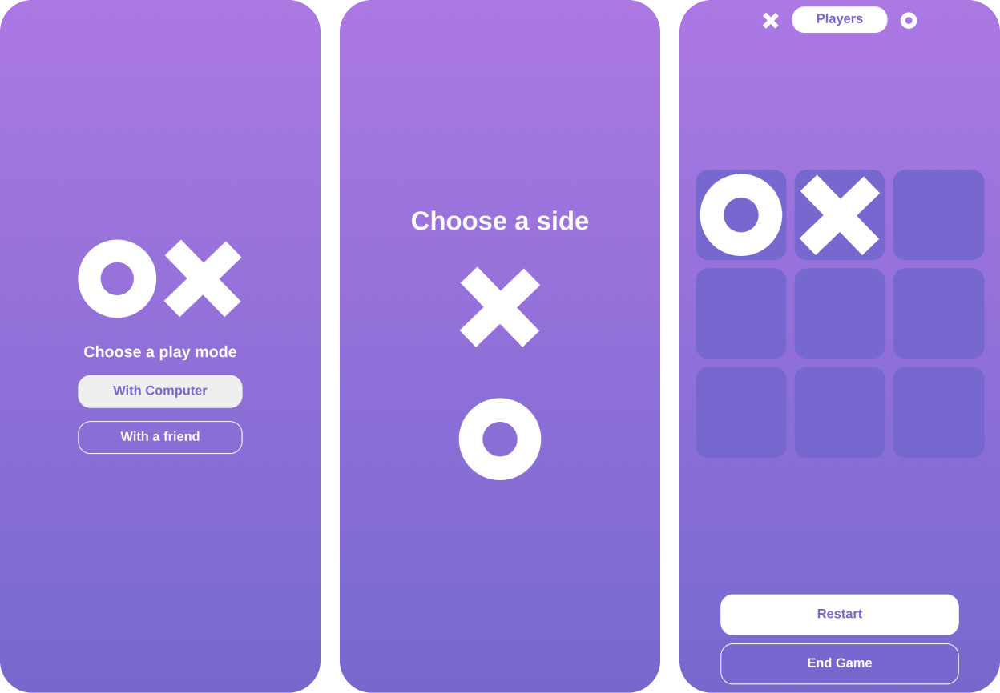
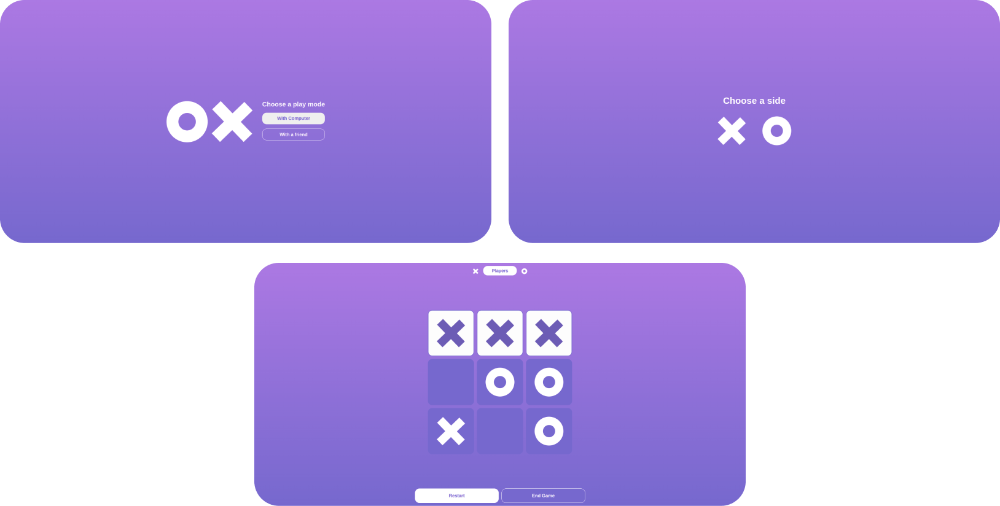

# Tic Tac Toe

<svg width="100" height="100" viewBox="0 0 219 219" fill="none" xmlns="http://www.w3.org/2000/svg">
<rect width="219" height="219" rx="30" fill="url(#paint0_linear_0_1)"/>
<circle cx="62" cy="109" r="32" stroke="white" stroke-width="26"/>
<path d="M126.058 72.9503L160.879 109.008M160.879 109.008L194.829 144.165M160.879 109.008L196.035 75.058M160.879 109.008L124.821 143.829" stroke="white" stroke-width="26"/>
<defs>
<linearGradient id="paint0_linear_0_1" x1="109.5" y1="0" x2="109.5" y2="219" gradientUnits="userSpaceOnUse">
<stop offset="0.000100017" stop-color="#A969E3"/>
<stop offset="0.82" stop-color="#704BCE"/>
</linearGradient>
</defs>

This game is mostly made to practice `factory functions` and some topics relating to `objects` and `closures` in javascript.

### Phone view

### Desktop view

</svg>

